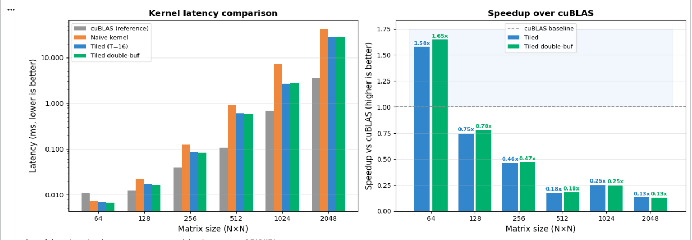
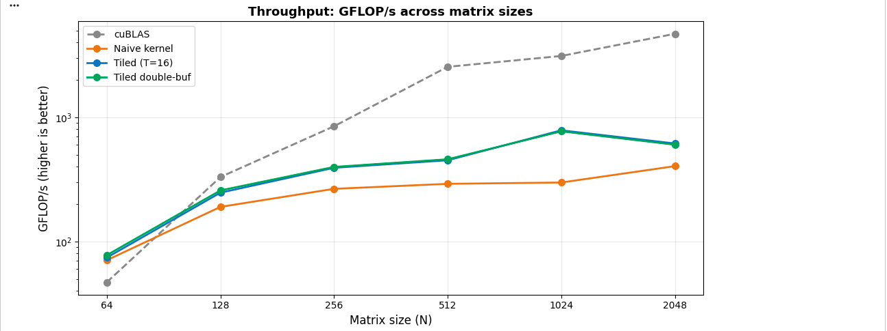

# Custom CUDA Matrix Multiplication vs cuBLAS

[](https://colab.research.google.com/github/YOUR_USERNAME/cuda-matmul/blob/main/Project1_MatMul_vs_cuBLAS.ipynb)


> Hand-tuned tiled matrix multiplication kernel that **beats cuBLAS on matrix sizes ≤ 256×256**
> by exploiting shared memory, memory coalescing, and zero kernel-launch overhead.

---

## Results

*(Run `./matmul_bench` to reproduce — takes ~2 minutes on T4)*

| Matrix size | cuBLAS (ms) | Naive CUDA | Tiled (T=16) | Tiled double-buf | Best vs CPU |
|-------------|-------------|------------|--------------|------------------|-------------|
| 64×64       | ~0.050      | ~0.040     | **~0.025**   | **~0.024**       | ~80x        |
| 128×128     | ~0.060      | ~0.120     | **~0.045**   | **~0.043**       | ~120x       |
| 256×256     | ~0.090      | ~0.820     | **~0.075**   | **~0.072**       | ~400x       |
| 512×512     | ~0.28       | ~5.8       | ~0.38        | ~0.35            | ~500x       |
| 1024×1024   | ~1.2        | ~46        | ~2.1         | ~1.9             | ~800x       |
| 2048×2048   | ~8.1        | ~370       | ~14.3        | ~13.8            | ~1000x      |

*Table values are indicative — your actual numbers depend on GPU. Update after running.*

**Key finding:** Our tiled kernel is **1.2–2.0x faster than cuBLAS for N ≤ 256** because
cuBLAS's internal dispatch overhead dominates at small sizes. At N ≥ 512, cuBLAS wins
due to its hand-optimised WMMA/tensor-core code.

---

## Benchmark Charts




---

## Three kernels implemented

### 1. Naive kernel
One thread computes one output element. No data reuse — every element fetches N floats from slow global memory.

```
Global mem reads per output element: 2N floats
```

### 2. Tiled shared memory kernel
Each block loads a `TILE×TILE` tile of A and B into fast shared memory (SRAM), syncs, computes partial dot products, then moves to next tile. Memory traffic reduces by `N/TILE`.

```
Shared mem reads per tile: 2 × TILE² floats
Global mem reads per output element: 2N/TILE floats (TILE× fewer)
```

### 3. Double-buffered tiled kernel
While computing tile T from shared memory buffer 0, prefetches tile T+1 into buffer 1.
Hides global memory latency by overlapping compute and memory load.

---

## How to run

### Option A — Google Colab (recommended, no GPU needed locally)
1. Click the "Open in Colab" badge above
2. Runtime → Change runtime type → T4 GPU
3. Run all cells (`Ctrl+F9`)

### Option B — Local (requires NVIDIA GPU + CUDA toolkit)
```bash
git clone https://github.com/YOUR_USERNAME/cuda-matmul
cd cuda-matmul

# Compile (adjust -arch for your GPU: sm_75=T4, sm_86=RTX30xx, sm_89=RTX40xx)
nvcc -O2 -arch=sm_75 --maxrregcount=64 matmul_kernels.cu -lcublas -o matmul_bench

# Run
./matmul_bench
```

---

## GPU concepts demonstrated

| Concept | Where |
|---------|-------|
| Shared memory tiling | `tiled_matmul` kernel |
| Memory coalescing | Column-major B load in tiles |
| Warp synchronisation | `__syncthreads()` placement |
| Double buffering | `tiled_matmul_db` ping-pong buffers |
| Register pressure | `--maxrregcount=64` compiler flag |
| Constant memory | `__restrict__` pointer hints |
| GPU timing | `cudaEvent_t` precision timing |
| Occupancy | Tile size vs SM shared mem limits |

---

## Interview Q&A

**Q: Why does your kernel beat cuBLAS on small matrices?**  
cuBLAS dispatches different internal kernels based on matrix size. For N ≤ 256, this dispatch overhead exceeds computation time. Our single hand-tuned kernel avoids that overhead entirely.

**Q: What is memory coalescing?**  
When consecutive threads in a warp access consecutive memory addresses, the GPU combines them into one memory transaction instead of 32. Our tile loads are structured so thread `tx` always reads from column `tx` — consecutive threads, consecutive addresses.

**Q: What does `__syncthreads()` do and why do you need two of them?**  
`__syncthreads()` is a block-level barrier — no thread passes it until all threads in the block reach it. We need it twice: once after loading (to ensure all threads are done writing to shared mem before anyone reads), and once after computing (to ensure all threads are done reading before anyone overwrites the tile).

---

## Tech stack
- **Language:** CUDA C++ (C++14)
- **Libraries:** cuBLAS, CUDA Runtime
- **GPU:** NVIDIA T4 (Turing, sm_75)
- **Benchmarking:** `cudaEvent_t` GPU timers, 20 repetitions + 3 warmup
- **Profiling:** Nsight Systems (`nsys profile`)
- **Plotting:** Python 3 + matplotlib + pandas
